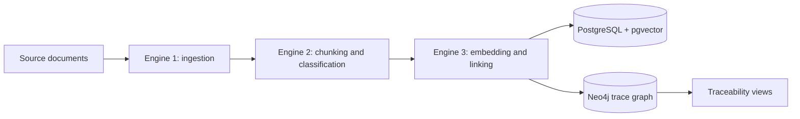

# Trace Matrix

Trace Matrix is a planned requirements-traceability pipeline for extracting content from engineering documents, classifying it into traceable chunks, finding semantic links, and storing the resulting relationships in a graph.

The project is currently at the initial setup stage. The local persistence services are available through Docker Compose, while the Python pipeline modules and application entrypoint are scaffolds for upcoming implementation.

## Planned pipeline



- **Engine 1 - Ingestion:** parse source documents, with Docling intended for document extraction.
- **Engine 2 - Chunking:** split extracted content into traceable units, classify them, and assign stable identifiers.
- **Engine 3 - Linking:** generate embeddings, rerank candidate relationships, and write links to the graph.
- **PostgreSQL:** intended for structured records and vector search through `pgvector`.
- **Neo4j:** intended for traversing and analyzing trace relationships.
- **Streamlit:** dashboard for coverage metrics, matrix browsing, gap analysis, link review, and Excel export.

## Repository layout

```text
.
├── app.py                         # Streamlit dashboard entrypoint
├── data/                          # Local input data; ignored by Git
├── docker-compose.yml             # Neo4j and PostgreSQL services
├── database/
│   ├── db.txt                     # PostgreSQL schema
│   └── ingestor.py                # Engine 1 -> PostgreSQL writer
├── requirements.txt               # Python dependencies
└── src/
	├── config.py                  # Database and model settings
	├── db/
	│   └── postgres_client.py     # Query layer used by the dashboard
	├── engine1_ingestion/
	│   ├── parser.py              # Document ingestion
	│   └── schema.py              # Pydantic payload models
	├── engine2_chunking/
	│   └── chunker.py             # Chunking and embedding
	└── engine3_linker/
		└── linker.py              # Regex and semantic link generation
```

## Prerequisites

- Python 3.10 or newer
- Docker Desktop with Docker Compose
- Git

## Local setup

Create the virtual environment **outside** the repository when the repository lives in a
synced folder such as OneDrive; sync locks cause `WinError 5` during installation:

```powershell
python -m venv C:\venvs\trace-matrix
C:\venvs\trace-matrix\Scripts\python.exe -m pip install --upgrade pip setuptools wheel
C:\venvs\trace-matrix\Scripts\python.exe -m pip install -r requirements.txt
```

Start the local databases from the repository root:

```powershell
docker compose up -d
```

Apply the database schema once, after the containers are healthy:

```powershell
Get-Content database\db.txt -Raw | docker exec -i rtm_postgres psql -U admin -d rtm_db
```

Check service status with:

```powershell
docker compose ps
```

To stop the services while preserving their named volumes:

```powershell
docker compose down
```

To remove the persisted local database volumes as well:

```powershell
docker compose down -v
```

## Local services

| Service | Address | Default credentials / database |
| --- | --- | --- |
| Neo4j Browser | `http://localhost:7474` | User `neo4j`, password `password123` |
| Neo4j Bolt | `bolt://localhost:7687` | User `neo4j`, password `password123` |
| PostgreSQL | `localhost:5432` | Database `rtm_db`, user `admin`, password `password123` |

If port `5432` is already taken on your machine by a locally installed PostgreSQL, free it
rather than editing `docker-compose.yml`. Stop the Windows service and set it to manual
start from an elevated PowerShell:

```powershell
Stop-Service -Name postgresql-x64-<version> -Force
Set-Service -Name postgresql-x64-<version> -StartupType Manual
```

Alternatively, publish the container on another host port through a local, untracked
`docker-compose.override.yml` and point the application at it with `RTM_DB_PORT`.

These credentials are development defaults defined in `docker-compose.yml`. Do not use them in a shared or production environment. Configure secrets through environment variables before adding application connections.

## Running the pipeline

Set UTF-8 output first; the engines print Unicode status symbols that fail on a cp1252 console:

```powershell
$env:PYTHONUTF8 = "1"
```

Place source documents under `data/`, then run the engines in order:

```powershell
C:\venvs\trace-matrix\Scripts\python.exe -m src.engine1_ingestion.parser "data\<document>"
C:\venvs\trace-matrix\Scripts\python.exe -m src.engine2_chunking.chunker
C:\venvs\trace-matrix\Scripts\python.exe -m src.engine3_linker.linker
```

Engine 1 accepts `.docx`, `.pdf`, and `.xlsx` files as well as test-evidence folders, and
writes each parsed payload to PostgreSQL automatically. Engines 2 and 3 pick up whatever is
pending, so they take no arguments.

## Running the dashboard

```powershell
C:\venvs\trace-matrix\Scripts\python.exe -m streamlit run app.py
```

The application opens on `http://localhost:8501` and provides:

- **Overview** - requirement coverage, link counts, and per-document breakdowns
- **Traceability matrix** - filterable link table with Excel export
- **Gap analysis** - uncovered requirements and unlinked test/risk items, with Excel export
- **Review queue** - approve or reject semantic suggestions below the auto-approve threshold
- **Item explorer** - inspect a single item's content, metadata, and links in both directions

## Current status

The repository currently contains:

- Docker Compose definitions for Neo4j 5 Community and PostgreSQL 16 with `pgvector`.
- A working three-engine pipeline from document ingestion through link generation.
- A Streamlit dashboard backed by `src/db/postgres_client.py`.

The following pieces are not implemented yet:

- Neo4j graph persistence; the container runs but no client writes to it
- Reranking of semantic candidates
- Vision-language descriptions for diagrams and screenshots
- Automated tests and CI

## Development notes

- Keep source documents and other local inputs under `data/`; raw local data is excluded by `.gitignore`. Database persistence is managed by Docker named volumes.
- Do not commit `.env` files or credentials.
- Add the required spaCy language model explicitly when the classifier implementation selects one; installing the `spacy` package alone does not install a model.
- When adding application settings, prefer environment variables for database URLs, credentials, model names, and input paths.

## License

No license has been declared for this repository yet.