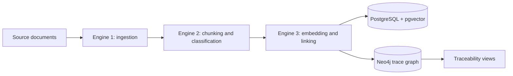

# Trace Matrix

Trace Matrix is a planned requirements-traceability pipeline for extracting content from engineering documents, classifying it into traceable chunks, finding semantic links, and storing the resulting relationships in a graph.

The project is currently at the initial setup stage. The local persistence services are available through Docker Compose, while the Python pipeline modules and application entrypoint are scaffolds for upcoming implementation.

## Planned pipeline



- **Engine 1 - Ingestion:** parse source documents, with Docling intended for document extraction.
- **Engine 2 - Chunking:** split extracted content into traceable units, classify them, and assign stable identifiers.
- **Engine 3 - Linking:** generate embeddings, rerank candidate relationships, and write links to the graph.
- **PostgreSQL:** intended for structured records and vector search through `pgvector`.
- **Neo4j:** intended for traversing and analyzing trace relationships.
- **Streamlit:** included as the planned interface layer.

## Repository layout

```text
.
├── app.py                         # Application entrypoint (planned)
├── data/                          # Local input data; ignored by Git
├── docker-compose.yml             # Neo4j and PostgreSQL services
├── requirements.txt               # Python dependencies
└── src/
	├── db/
	│   ├── neo4j_client.py        # Neo4j access layer
	│   └── postgres_client.py     # PostgreSQL access layer
	├── engine1_ingestion/
	│   └── parser.py              # Document ingestion
	├── engine2_chunking/
	│   ├── classifier.py          # Chunk classification
	│   └── id_generator.py        # Stable chunk identifiers
	└── engine3_linker/
		├── embedder.py            # Embedding generation
		├── graph_writer.py        # Graph persistence
		└── reranker.py            # Candidate-link reranking
```

## Prerequisites

- Python 3.10 or newer
- Docker Desktop with Docker Compose
- Git

## Local setup

Create and activate a virtual environment, then install the Python dependencies:

```powershell
python -m venv venv
.\venv\Scripts\Activate.ps1
python -m pip install --upgrade pip
pip install -r requirements.txt
```

Start the local databases from the repository root:

```powershell
docker compose up -d
```

Check service status with:

```powershell
docker compose ps
```

To stop the services while preserving their named volumes:

```powershell
docker compose down
```

To remove the persisted local database volumes as well:

```powershell
docker compose down -v
```

## Local services

| Service | Address | Default credentials / database |
| --- | --- | --- |
| Neo4j Browser | `http://localhost:7474` | User `neo4j`, password `password123` |
| Neo4j Bolt | `bolt://localhost:7687` | User `neo4j`, password `password123` |
| PostgreSQL | `localhost:5432` | Database `rtm_db`, user `admin`, password `password123` |

These credentials are development defaults defined in `docker-compose.yml`. Do not use them in a shared or production environment. Configure secrets through environment variables before adding application connections.

## Current status

The repository currently contains:

- Docker Compose definitions for Neo4j 5 Community and PostgreSQL 16 with `pgvector`.
- Python dependency declarations for document parsing, NLP, embeddings, graph access, and UI work.
- The directory structure for the three planned processing engines and database clients.

The following pieces are not implemented yet:

- Document parsing and ingestion flow
- Chunk classification and ID generation
- Embedding, reranking, and link creation
- Neo4j/PostgreSQL client logic and schema initialization
- Streamlit screens or another runnable application flow
- Automated tests and CI

Consequently, there is no runnable `app.py` command yet. The first executable milestone should add configuration management and database connection health checks before wiring the ingestion pipeline.

## Development notes

- Keep source documents and other local inputs under `data/`; raw local data is excluded by `.gitignore`. Database persistence is managed by Docker named volumes.
- Do not commit `.env` files or credentials.
- Add the required spaCy language model explicitly when the classifier implementation selects one; installing the `spacy` package alone does not install a model.
- When adding application settings, prefer environment variables for database URLs, credentials, model names, and input paths.

## License

No license has been declared for this repository yet.